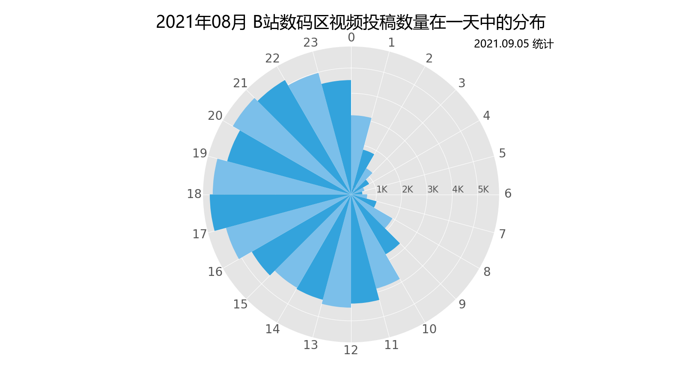
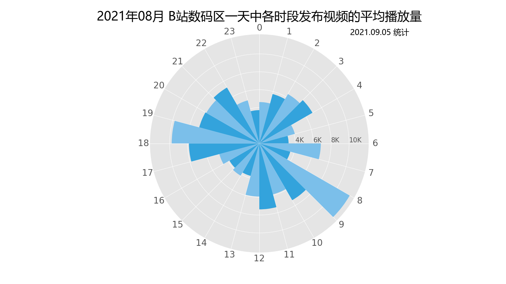
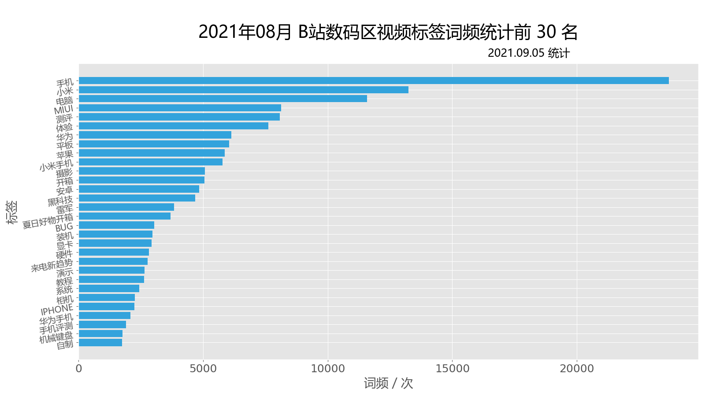
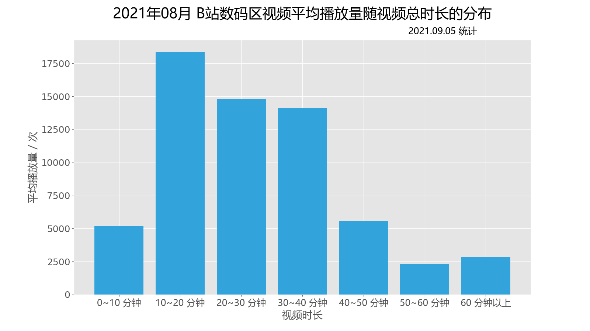

# 数据分析

对 2021年08月 B站数码区 `81380` 条视频进行简单的数据分析

## 一、投稿时间

- 统计方法：统计每日每小时内发布的视频数量，相同小时段进行累加
- 统计程序：见 `analysize.py` 中的 `pic01()` 函数
- **结论：数码区UP主更偏向于在晚上发布视频**
- 分析：如图可以发现 16 时至 22 时，每小时视频总量均超过 5k ，超出其他时段较为明显

## 二、播放量与发布时段

- 统计方法：统计每日每小时内发布视频的数量和播放量，相同小时段进行累加求平均
- 统计程序：见 `analysize.py` 中的 `pic01()` 函数
- **结论：早晨 8~9 点和傍晚 6~7 点发布的视频更可能获得较高播放量**
- 分析：如图可以发现 8~9 时和 18~19 时发布的视频平均播放量均在一万左右，超出其他时段较为明显

## 三、标签统计

- 统计方法：对视频标签进行词频统计
- 统计程序：见 `analysize.py` 中的 `pic2()` 函数
- **结论：相比于电脑，手机相关主题在数码区更受关注；小米是这一个月数码区最受关注的品牌。**
- 分析：如图可以发现带有手机标签的视频数量是带有电脑标签的两倍左右；小米作为标签出现在约一万三千条视频中，远超其他品牌

## 四、播放量与视频总时长

- 统计方法：统计对应时长视频的平均播放量
- 统计程序：见 `analysize.py` 中的 `pic3()` 函数
- **结论：10~40 分钟的视频更可能获得较高播放量**
- 分析：如图可以发现 10~40 分钟的视频平均播放量在一万五千左右，明显超出其他时长视频平均五千的播放量
